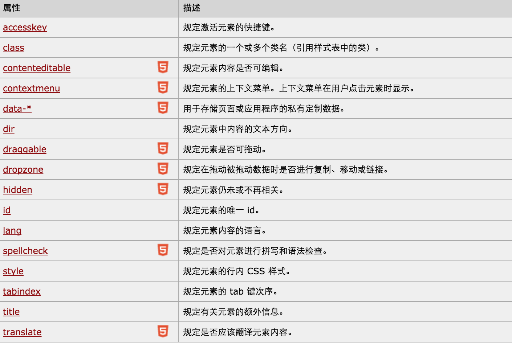
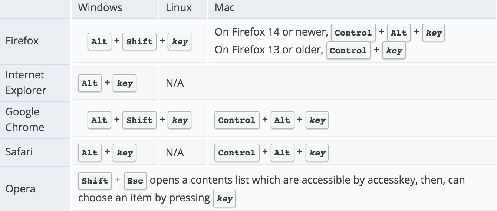
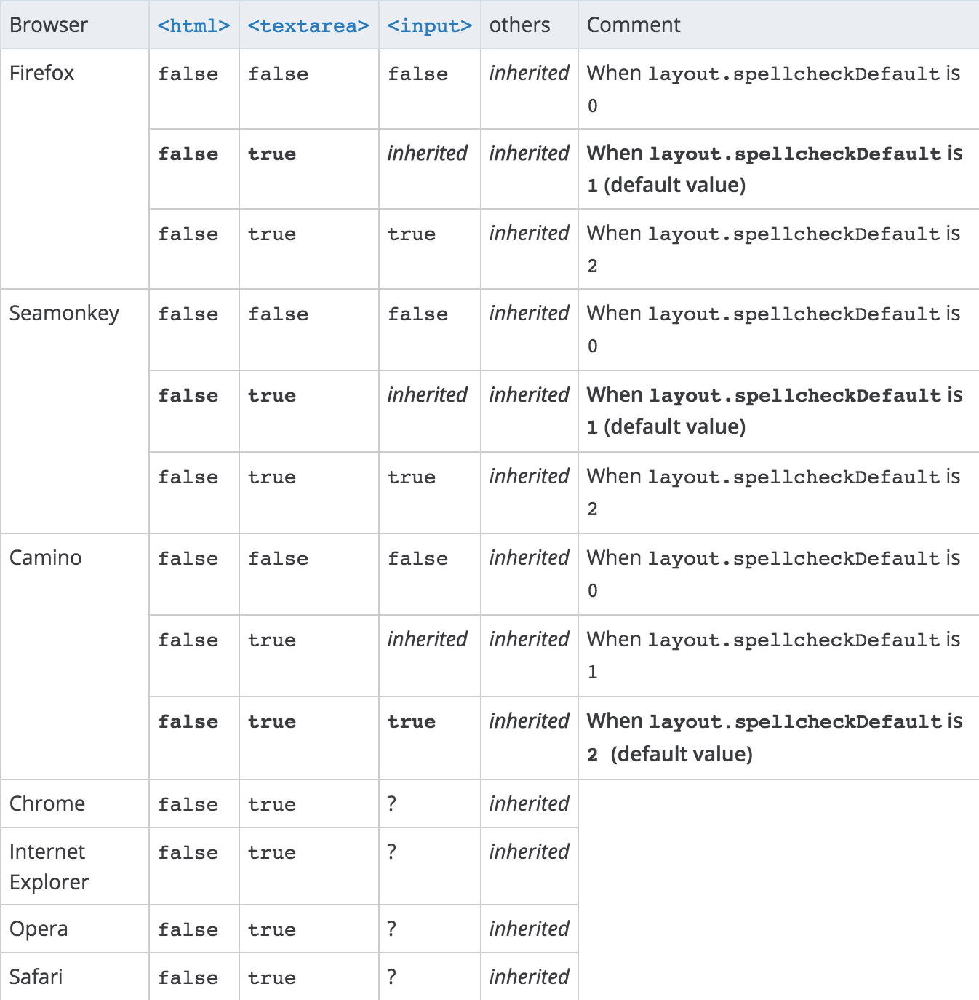

## 全局属性.md

所有元素都支持的属性，只不过有些属性在一些元素上没有什么效果罢了。定义在 `HTMLElement.prototype` 上，会被其它类型的元素所继承。非标准的元素也可以使用这些属性，甚至在 HTML5 不兼容的文档类型下这些元素的使用方式也可以用。

除了下面要讲的这些全局属性外，还有一些属性也是全局的：

1. 继承自 XHTML 规范的，`xml:lang` 和 `xml:base`，已经被弃用，但是为了兼容而保留。
2. `aria-*` 属性。
3. 事件相关属性。



### `accesskey`

可以为一些元素指定激活的快捷键。`<a>`、`<area>`、`<button>`、`<input>`、`<label>`、`<legend>` 以及 `<textarea>` 有效，不过这个来自 w3cschool 可信度不高，mdn 上没有指出。

```
<a href="javascript:alert('accesskey=g')" accesskey="g">a 标签</a>
```



根据上面这张图的要求，在我的 mac 下，按 `control+alt+g`，那么浏览器就会弹出 `accesskey=g`。另外，这个属性没有兼容性问题，不过好像用处不大。

### `class`

这个没什么好说的。

### `contenteditable`

元素内容是否可以编辑，没什么浏览器兼容问题。如果元素未设置 contenteditable 属性，那么元素会从其父元素继承该属性。

### `contextmenu`

右键会显示 `contextmenu` 指定的值为 `id` 的 `menu`。目前只有 FireFox 支持，所以别想用。

### `data-*`

`data-*` 属性用于存储页面或应用程序的私有自定义数据。`data-*` 属性赋予我们在所有 HTML 元素上嵌入自定义 `data` 属性的能力。存储的（自定义）数据能够被页面的 JavaScript 中利用，以创建更好的用户体验（不进行 Ajax 调用或服务器端数据库查询）。兼容性没有问题，浏览器可以通过元素的 `dataset` 属性来访问和操作 `data-*` 属性。

`data-*` 属性包括两部分：
- 属性名不应该包含任何大写字母，并且在前缀 "data-" 之后必须有至少一个字符。
- 属性值可以是任意字符串。

> 用户代理会完全忽略前缀为 "data-" 的自定义属性。

### `dir`

文本的显示方向，默认为 `ltr` 从左往右，`rtl` 表示从右往左，`auto` 表示由用户代理决定是 HTML5 加入的。没有兼容问题。

- `bdo`：必须有 `dir`，因为 `bdo` 是用来改变文本的默认方向的。
- `bdi`：允许您设置一段文本，使其脱离其父元素的文本方向设置。在发布用户评论或其他您无法完全控制的内容时，该标签很有用。不可继承。未赋值时，它的默认值是 `auto`。兼容性差，只有 Chrome、FireFox 支持。
- 可以被 css 属性 `direction` 和 `unicode-bidi` 覆盖，但是使用 `dir` 会比 css 好。

> `dir` 属性在以下标签中无效：`<applet>`、`<base>`、`<basefont>`、`<bdo>`、`<br>`、`<frame>`、`<frameset>`、`<iframe>`、`<param>` 和 `<script>`。

### `draggable`

默认情况下，只有已选中的文本、图片、链接可以拖动。对其它的元素来说，必须按拖动机制的顺序设置 `ondragstart` 事件才能正常工作。没有兼容问题。

### `dropzone`

还没有浏览器支持，哈哈！

### `hidden`

IE 11 才支持，因此在 Normalize.css 中预置了 `[hidden] { display:none}` 样式。这也说明了这个属性会被 `display` 所覆盖，比如设置了 `hidden` 的元素如果如果有 `dispaly:flex` 等，那么还是会显示元素的。

### `id`

和 `class` 一样，没什么好说的。

### `itemid`、`itemprop`、`itemref`、`itemscope`、`itemtype` 

[HTML5 微数据](http://www.zhangxinxu.com/wordpress/2011/12/html5%E6%89%A9%E5%B1%95-%E5%BE%AE%E6%95%B0%E6%8D%AE-%E4%B8%B0%E5%AF%8C%E7%BD%91%E9%A1%B5%E6%91%98%E8%A6%81/)

### `lang`

指定元素文本内容的语言，好像没什么卵用，查了下好像是搜索引擎有点用，Chrome 还会根据它来问你要不要翻译。`<applet>`、`<base>`、`<basefont>`、`<br>`、`<frame>`、`<frameset>`、`<iframe>`、`<param>` 和 `<script>` 不支持。

### `spellcheck`

规定是否对元素进行拼写和语法检查。没什么兼容性问题，但是基本也用不太到吧。



### `style`

行内样式，略。

### `tabindex`

只有 `<a>`、`<area>`、`<input>`、`<button>`、`<object>`、`<select>` 和 `<textarea>` 有用。
 
`tabindex=-1` 会被跳过，没有设置的时候按 `tab` 会与源码中的顺序一致。1 是第一个。
 
### `title`
 
规定了关于元素的额外信息，鼠标停在上面时会显示。
 
`<base>`、`<basefont>`、`<head>`、`<html>`、`<meta>`、`<param>`、`<script>` 和 `<title>` 不支持。多行的兼容性差，单行没问题。
 
### `translate`
 
`translate` 规定是否应该翻译元素内容。兼容性差，都不支持。
